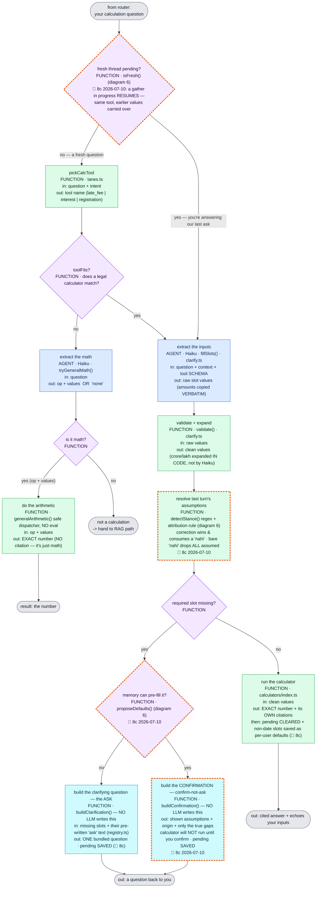
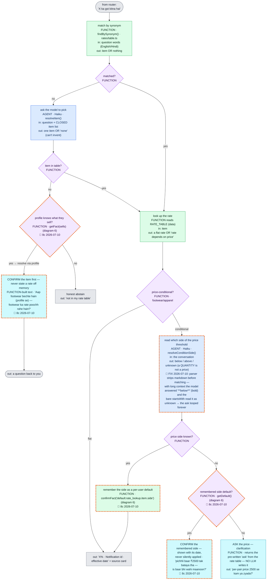
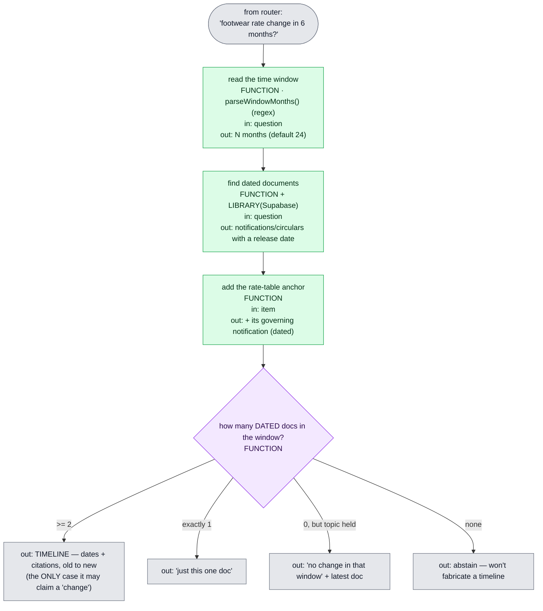
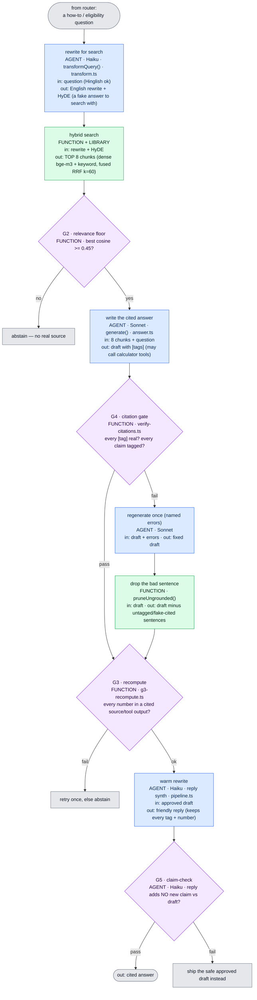
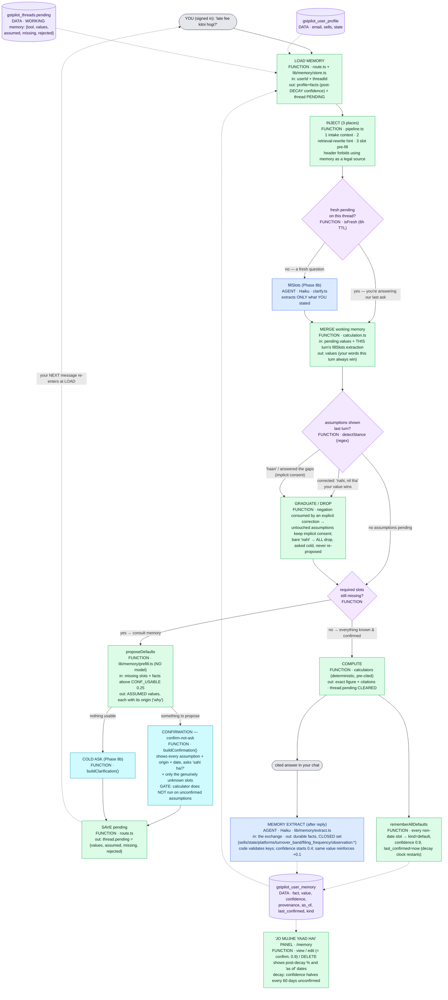
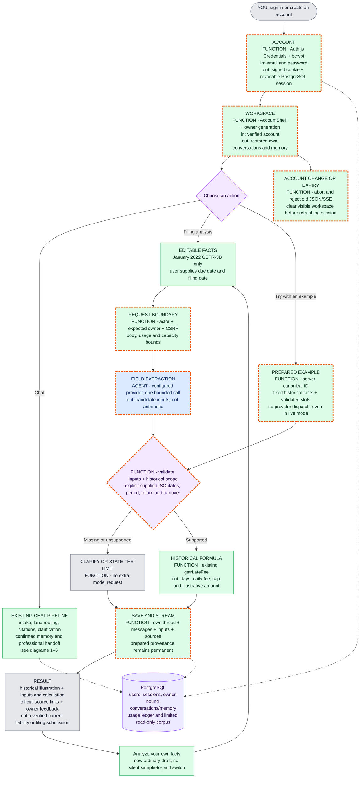

# GSTPilot — Architecture Flow (visual, for debugging)

> Built so a non-engineer can trace what happens without reading code. **Every box is ONE step** and tells you: is it an **AGENT** (an LLM decides) or a **FUNCTION** (plain code) · its **in:** (what goes in) · its **out:** (what comes out). Data flows box → box. When something misbehaves, find the box and open its file (index at the bottom).

## Legend

| Colour | Meaning |
|---|---|
| **blue** | **AGENT** — the configured model does this step |
| **green** | **FUNCTION** — our deterministic TypeScript, no model |
| **teal** | a **question back to you** (the clarification / ASK) |
| **purple diamond** | a **decision** (who decides is on the box) |
| **grey** | a **result** (answer / abstain / escalate) |
| **lilac** | **data / library** (PostgreSQL · rate table · embedding adapter) |
| **orange dashed border** | **🔧 recently FIXED / 🔄 recently CHANGED** — the box carries a dated 🔧/🔄 line saying what changed and why; flags are removed next phase once test-ridden |

Read each box as: **NAME · [AGENT/FUNCTION] · in: … · out: …**

---

## 1 · MASTER FLOW — one question, end to end (incl. the clarification loop)

```mermaid
flowchart TD
  %% Authenticated entry and the separate one-extraction filing path are in diagram 7.
  U(["YOU: a question<br/>'footwear ka gst kitna hai'"]):::term --> API

  API["API ENTRY<br/>FUNCTION · app/api/ask/route.ts<br/>in: your question + owned threadId + verified session<br/>out: question + CONTEXT (last-20-turns + summary)<br/>+ loads DURABLE MEMORY (profile+facts) + thread PENDING (diagram 6)"]:::fn --> INTAKE

  MEMDB[("user_memory + user_profile<br/>DATA · PostgreSQL · loaded per owner/turn")]:::data -.-> API

  INTAKE["INTAKE — classify<br/>AGENT · configured small model · intake.ts<br/>in: question + context + memory block (background only)<br/>out: intent, tier, lane"]:::agent --> G1{"valid output?<br/>FUNCTION · repairIntake() then zod<br/>🔧 FIX 2026-07-10: known vocab slips (lane-word-as-intent)<br/>repaired IN CODE before zod — TIER is never repaired,<br/>invalid risk still fails up (was: benign how-to → wrong T3)"}:::dec

  G1 -->|"API kept failing (transient)"| SVC["serviceError<br/>FUNCTION · out: 'service busy, try again'"]:::term
  G1 -->|"output malformed x2"| CA
  G1 -->|"ok"| T3{"tier == T3?<br/>FUNCTION · a live dispute?"}:::dec

  T3 -->|"yes"| CA["CA HANDOFF<br/>FUNCTION · caHandoff()<br/>in: question · out: summary for a human CA<br/>(malformed lands here too: risk unknown = fail-safe)"]:::term
  T3 -->|"no"| ROUTER["ROUTER<br/>FUNCTION (NO model) · reconcileLane()<br/>in: intent + lane + question · out: the chosen lane<br/>🔧 FIX 2026-07-10: guidance guard — a substantive intent OR a<br/>substantive keyword (refund/registration/ITC/…) forces the<br/>grounded RAG path (guidance briefly answered refund UNCITED)"]:::fn

  ROUTER --> LANE{"which lane?"}:::dec
  LANE -->|"calculation"| CALC["CALCULATION lane<br/>(diagram 2)"]:::fn
  LANE -->|"rate_lookup"| RATE["RATE lane<br/>(diagram 3)"]:::fn
  LANE -->|"change_over_time"| TIME["TIMELINE lane<br/>(diagram 4)"]:::fn
  LANE -->|"guidance (drafting/wording help ONLY —<br/>code guard: substantive words → RAG)"| GUIDE["GUIDANCE lane<br/>AGENT · configured main model · lanes/guidance.ts<br/>in: question + memory · out: practical example, NO rates/amounts/sections<br/>(G6 FUNCTION strips any that slip) + standing disclaimer<br/>🔧 NEW 2026-07-10 (bug fix: 'description mein kya likhun' was<br/>wrongly T3-escalated — benign how-to had no lane)"]:::agent
  LANE -->|"procedure / eligibility /<br/>refund / out_of_scope"| RAG["RAG path<br/>(diagram 5)"]:::fn

  CALC --> OUTCOME{"lane result?"}:::dec
  RATE --> OUTCOME
  TIME --> OUTCOME
  GUIDE --> OUTCOME
  RAG --> OUTCOME

  OUTCOME -->|"has everything it needs"| ANS["CITED ANSWER<br/>out: answer + source cards"]:::term
  OUTCOME -->|"sources don't cover it"| AB["HONEST ABSTAIN"]:::term
  OUTCOME -->|"a required input is MISSING<br/>and memory has NOTHING to propose"| ASK["CLARIFYING QUESTION — the ASK move<br/>built by a FUNCTION from pre-written phrases (NO LLM writes it)<br/>out: ONE question back to you, e.g. 'per-pair price 2500 se kam ya zyada?'"]:::ask
  OUTCOME -->|"a required input is MISSING<br/>but memory CAN propose it"| CONF["CONFIRMATION — confirm-not-ask (diagram 6)<br/>FUNCTION · buildConfirmation() — pre-written phrases, NO LLM<br/>out: shown assumptions + 'sahi hai?' + only the true gaps<br/>RULE: the number is NOT computed until you confirm"]:::ask

  ANS --> OUT2["OUTPUT<br/>FUNCTION · route.ts<br/>in: answer · out: source cards + saved msg + streamed to chat"]:::fn
  OUT2 --> MEMX["MEMORY EXTRACT (after reply, fire-and-forget)<br/>AGENT · configured small model · lib/memory/extract.ts<br/>in: this turn's exchange · out: durable facts (CLOSED set) → user_memory<br/>confidence starts LOW (0.4); only YOUR confirmation raises it"]:::agent
  MEMX -.-> MEMDB
  OUT2 --> DONE(["shown in your chat"]):::term
  ASK --> DONE
  CONF --> DONE

  %% ---- THE CLARIFICATION LOOP: how the agent 'asks' across turns ----
  DONE -.->|"YOU type the answer in the NEXT message"| U2(["YOU: '800 per pair'"]):::term
  U2 -.->|"SAME thread → API buildContext() adds the prior turn as MEMORY,<br/>so the lane now finds the missing input and computes"| API

  classDef agent fill:#dbeafe,stroke:#2563eb,color:#0b2a5b;
  classDef fn fill:#dcfce7,stroke:#16a34a,color:#052e16;
  classDef dec fill:#f3e8ff,stroke:#9333ea,color:#2a0a4a;
  classDef term fill:#e5e7eb,stroke:#6b7280,color:#111827;
  classDef ask fill:#cffafe,stroke:#0891b2,color:#083344;
  classDef data fill:#ede9fe,stroke:#7c3aed,color:#2a0a4a;
  %% fix flag: orange dashed border layered ON TOP of a box's base colour
  classDef fix stroke:#ea580c,stroke-width:3px,stroke-dasharray:6 3;
  class G1,ROUTER,GUIDE fix;
```

> **How the ASK works (plain):** a lane that's missing an input doesn't guess — it returns a **question** as its reply. That question is shown in chat. When **you answer in the next message**, the API's `buildContext()` re-sends the *previous* turn as memory, so on this second pass the same lane finds the value and computes. No special state machine — the thread memory carries it.
>
> **Who actually writes the question? A FUNCTION, not an LLM.** The model (`fillSlots`) only *extracts* what you already gave and *flags* which required inputs are missing. A separate FUNCTION (`buildClarification`, or the rate table's stored `ask` line) then stitches the **pre-written `ask` phrases** from the tool's schema (`registry.ts`) into one message. So the wording is deterministic and reviewable — the LLM never composes the question.

---

## 2 · CALCULATION lane — extract, then compute (agent vs code kept separate)

> **Your question, answered:** when no legal calculator fits, **Haiku does NOT do the math** — it only *extracts* `op + values` (e.g. `percent_of, [18, 50000]`); the actual number is computed by **`generalArithmetic` (FUNCTION, no `eval`)**. And if the model says it isn't a calculation at all → it drops to the **RAG path**. Extract (agent) and compute (code) are two separate boxes on purpose.
>
> **And the ASK is the same split:** `fillSlots` (AGENT) extracts + finds the missing inputs; `buildClarification` (FUNCTION) writes the question from the schema's pre-written phrases. **No LLM composes the question.**

---

## 3 · RATE lane — find the item, then the pre-cited rate

---

## 4 · TIMELINE lane — change-over-time (bounded & honest)

---

## 5 · RAG path + gates — grounded answer, checked at each step

---

## 6 · MEMORY (Phase 8c) — three types, one non-negotiable rule

> **The three memory types, kept distinct:** **WORKING** = this thread's live slot-gather, persisted as one `pending` object on the thread (resume, don't re-derive). **BEHAVIORAL** = durable facts about *you* (sells, state, platforms, turnover band), model-extracted after each turn at LOW confidence. **PROCEDURAL** = defaults *you confirmed* ("late fee" → monthly GSTR-3B), written only when a calculation actually runs or you say "haan".
>
> **The non-negotiable rule:** memory sets DEFAULTS and CONTEXT — it never silently drives a rate, a number, or an eligibility answer. Any remembered fact that would change one is SHOWN with its origin ("aapne pichhli baar confirm kiya tha, 2026-07-10") and CONFIRMED before the calculator runs. The confirmation UX *is* the verification: confirm → confidence rises to 0.9; correct → the fact is fixed; ignore for 60 days → confidence halves (decay) and it gets re-asked instead of assumed.
>
> **Who writes what:** the only AGENT in this flow is the extractor (closed key set, code validates). Proposing defaults (`prefill.ts`), building the confirmation (`buildConfirmation`), reading your "haan/nahi" (`detectStance`, a regex), and writing defaults are all FUNCTIONS — no LLM ever invents a memory key, composes the confirmation text, or decides that an assumption was accepted.

---

## 7 · The gates at a glance (safety spine)

| Gate | File | Actor | Threshold / check | On fail |
|---|---|---|---|---|
| **G1** schema | `intake.ts` | LIBRARY · zod | intake JSON valid + enums | re-ask; malformed x2 → T3 |
| **serviceError** | `intake.ts` | FUNCTION | transient (429/5xx/net) vs parse | honest "try again" |
| **T3 tier** | `pipeline.ts` | FUNCTION | is it a dispute? | escalate to CA |
| **G2** floor | `pipeline.ts` | FUNCTION | best cosine **≥ 0.45** | abstain |
| **G4** citation | `verify-citations.ts` | FUNCTION | every claim cites a REAL retrieved source | regen → prune |
| **prune** | `verify-citations.ts` | FUNCTION | drop bad sentence, keep cited rest | abstain if nothing left |
| **G3** recompute | `g3-recompute.ts` | FUNCTION | every number in a cited source/tool | retry → abstain |
| **G5** claim-check | `pipeline.ts` | AGENT · Haiku | reply adds no new claim | ship approved draft |

**Models:** Haiku = intake · transform · fillSlots · rate-resolve · reply/G5 · memory-extract (after reply). Sonnet = only the RAG generation. Embeddings = `bge-m3` (local, 1024-dim).

## 8 · File index

| Stage | File |
|---|---|
| API + memory + SSE | `app/api/ask/route.ts` |
| Sign-up (email-as-id) | `app/api/user/route.ts` |
| Memory panel API + UI | `app/api/memory/route.ts` · `app/memory/page.tsx` |
| Working memory (pending) | `lib/memory/working.ts` |
| Durable memory store + decay | `lib/memory/store.ts` |
| Memory extraction (agent) | `lib/memory/extract.ts` |
| Slot pre-fill (memory→slots) | `lib/memory/prefill.ts` |
| Orchestrator (spine) | `lib/agents/pipeline.ts` |
| Intake + G1 + serviceError | `lib/agents/intake.ts` |
| Router + lane taxonomy | `lib/agents/lanes.ts` |
| ASK move (clarify) | `lib/agents/clarify.ts` |
| Tool schemas | `lib/tools/registry.ts` |
| Lanes | `lib/agents/lanes/{calculation,rate,timeline}.ts` |
| Rate data + lookup | `lib/rates/{table,lookup}.ts` |
| Calculators | `lib/calculators/index.ts` |
| RAG generation | `lib/agents/answer.ts` |
| Retrieval (Hinglish rewrite) | `lib/retrieval/{transform,search,embed,config}.ts` |
| Gates | `lib/gates/{verify-citations,g3-recompute}.ts` |
| Observability | `lib/observability/langfuse.ts` |
</content>

## 7 · Account boundaries and historical filing (2026-10-01)

The filing action is separate from general chat: one field extraction then the existing deterministic formula. The server-owned prepared example shares calculation and persistence without a provider call. Only the reviewed January 2022 GSTR-3B illustration is supported; it does not establish current liability. Provider names shown in older detailed diagrams denote their original roles; runtime selection is centralized in `lib/providers/client.ts`.

